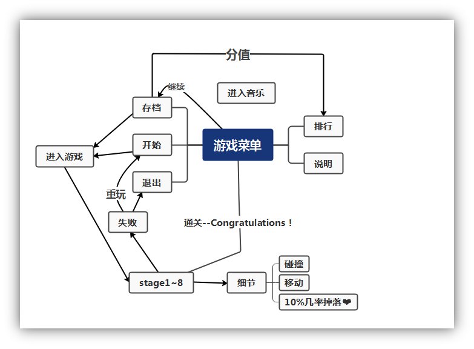
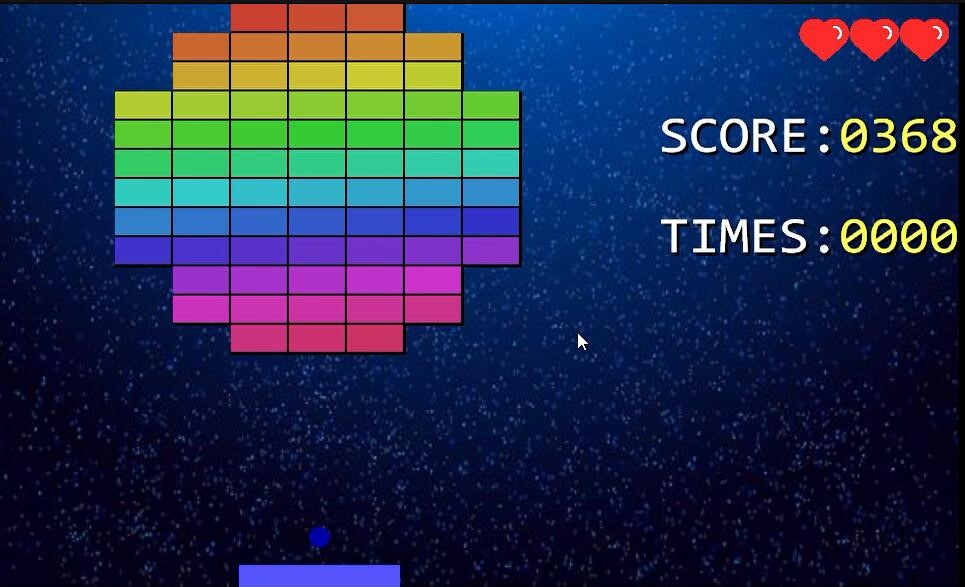
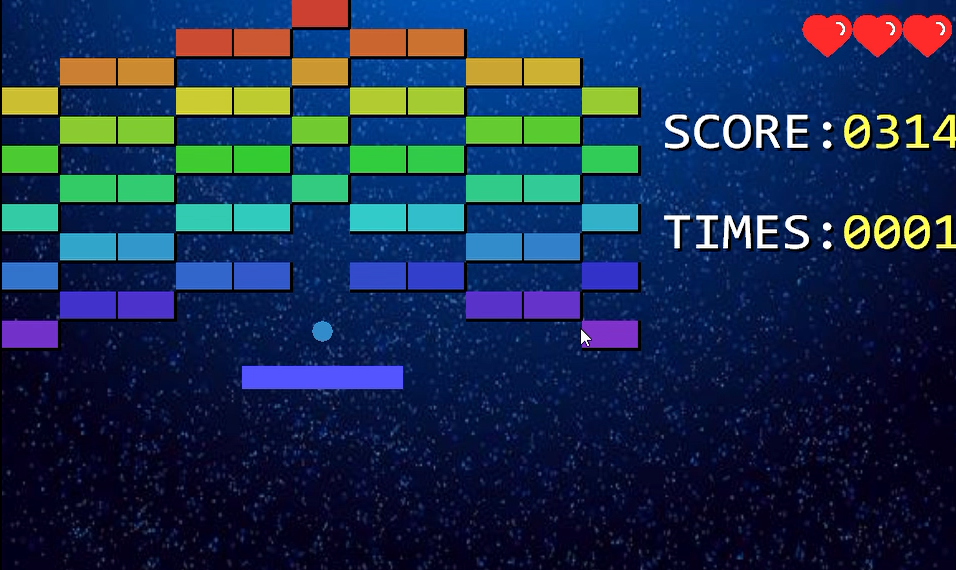
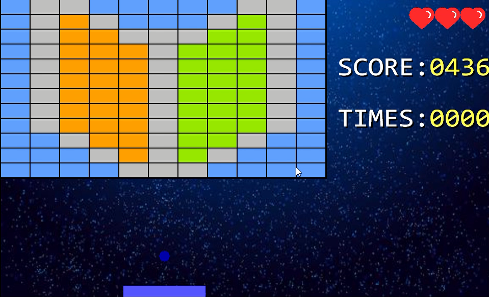
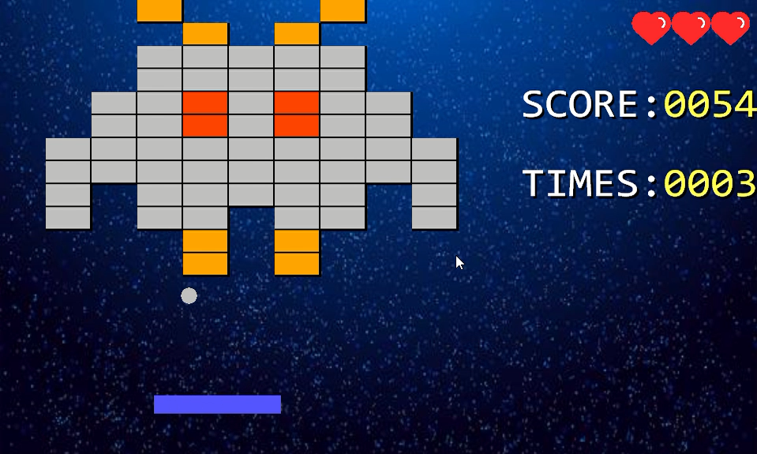
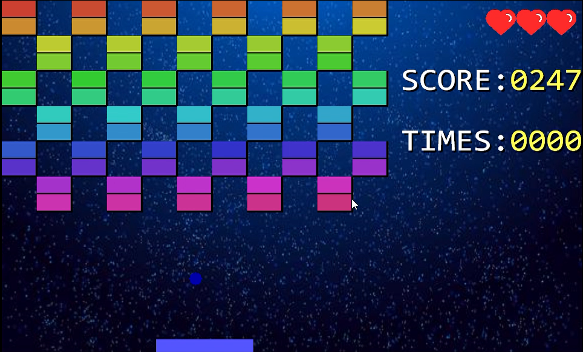
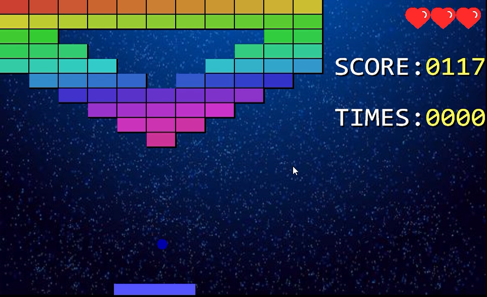
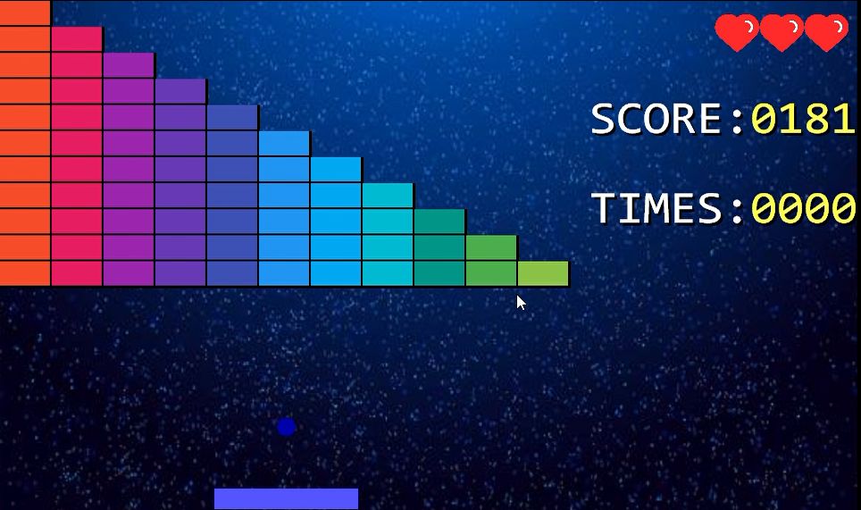
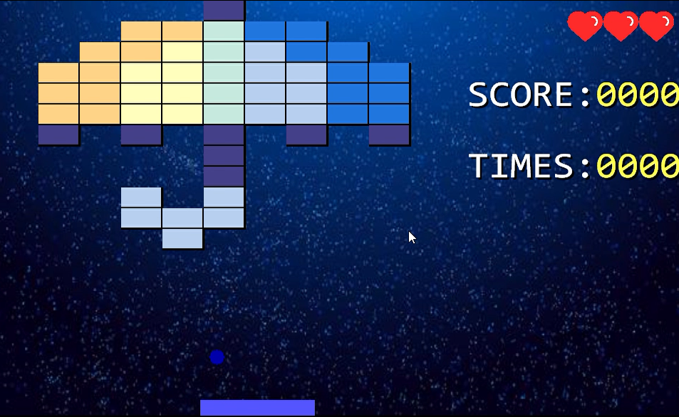

# 计算机程序设计课程实践项目报告C（C++）语言版砖块大战

作者：hyjwpk/MAX-WILL-WIN

## 摘要

本项目使用Visual Studio环境编写，使用EasyX库实现，通过玩家对横板的控制实现游戏互动，使玩家在控制小球击打砖块的过程中获得愉悦感，本游戏新增现代元素及创新性设计，可以为玩家提供新的游戏体验。

关键词：横板任意移动，音效生动有趣，可调游戏难度，可获游戏道具，生命上限、时间上限、游戏排行设计精美。

## 0 项目结构

```
│  blocks-battle.sln                    # visual studio 解决方案
│  cmd.c                                # 控制台版本
│
├─blocks-battle                         # c++源代码
│  │  ball.cpp
│  │  ball.h
│  │  blocks-battle.aps
│  │  blocks-battle.cpp
│  │  blocks-battle.h
│  │  blocks-battle.rc
│  │  blocks-battle.vcxproj
│  │  blocks-battle.vcxproj.filters
│  │  blocks-battle.vcxproj.user
│  │  board.cpp
│  │  board.h
│  │  brick.cpp
│  │  brick.h
│  │  button.cpp
│  │  button.h
│  │  color.cpp
│  │  color.h
│  │  cpp.hint
│  │  define.h
│  │  difficulty.cpp
│  │  difficulty.h
│  │  exit.cpp
│  │  exit.h
│  │  flash.cpp
│  │  flash.h
│  │  game.cpp
│  │  game.h
│  │  heart.cpp
│  │  heart.h
│  │  highscore.txt
│  │  load.cpp
│  │  load.h
│  │  menu.cpp
│  │  menu.h
│  │  mouse.cpp
│  │  mouse.h
│  │  music.cpp
│  │  music.h
│  │  musicbtn.cpp
│  │  musicbtn.h
│  │  pch.cpp
│  │  pch.h
│  │  resource.h
│  │  save.txt
│  │  script.cpp
│  │  script.h
│  │  settings.cpp
│  │  settings.h
│  │  stage.cpp
│  │  stage.h
│  │  star.cpp
│  │  star.h
│  │  start.cpp
│  │  start.h
│  │  time.cpp
│  │  time.h
│  │  top.cpp
│  │  top.h
│  │
│  └─Debug                              # visual studio 编译文件                             
│
└─Debug                                 # 可执行文件编译目录
    │  blocks-battle.exe
    │  blocks-battle.exe.lastcodeanalysissucceeded
    │  blocks-battle.pdb
    │  highscore.txt
    │  save.txt
    │
    └─resourses                         # 资源文件
        ├─document
        │      stage1.txt
        │      stage2.txt
        │      stage3.txt
        │      stage4.txt
        │      stage5.txt
        │      stage6.txt
        │      stage7.txt
        │      stage8.txt
        │
        ├─picture
        │      background.jpg
        │      heart.png
        │      heartmask.png
        │      tflash.png
        │      tflashmask.png
        │      球.ico
        │
        └─sound
                background.mp3
                crash.mp3
                dead.mp3
```

## 1 项目概述

### 1.1 项目特点

本游戏是以Visual Studio 2019/EasyX为开发环境开发出来的在Windows界面下的C/C++语言砖块弹球碰撞游戏，游戏画面流畅，操作简便，思路新颖，实现了完整的游戏流程，采用EasyX实现图形化，改善了游戏界面。

### 1.2 项目设计

打砖块游戏是经典的休闲游戏，通过方向键或鼠标的控制，让小球通过不断反弹消除砖块来获取分数。本项目通过C/C++语言来实现游戏功能，同时在传统的打砖块游戏基础上加入新的元素，提升游戏可玩性。

#### 1.2.1 功能分析

(1)单机闯关

(2)存档保存

(3)难度调节

(4)游戏道具

(5)分数排行

#### 1.2.2 性能分析

(1)游戏画面流畅

(2)游戏画面精美

(3)物理模型良好

### 1.3 小组分工

#### 1.3.1 hyjwpk

(1)游戏按钮

(2)游戏排行

(3)游戏地图

(4)得分机制

(5)背景音乐

(6)背景与过场

(7)道具掉落概率

(8)资源文件的封装

(9)多线程鼠标检测

(10)鼠标与键盘操控

(11)存档的写入与读取

#### 1.3.2 MAX-WILL-WIN

(1)游戏道具

(2)游戏分数

(3)游戏生命

(4)游戏说明

(5)计时模块

(6)横板移动机制

(7)关卡标题界面

(8)碰撞与死亡声音

(9)设置功能的设计

(10)按键移动及暂停

(11)横板的移动边界控制

## 2 系统设计

### 2.1 系统总体设计

#### 游戏有完善的开始界面，包括以下几项：

(1)开始游戏

(2)游戏说明

(3)游戏设置

(4)分数排行

(5)存档读取

(6)退出游戏

#### 游戏中的功能包括：

(1)游戏的暂停和开始

(2)游戏的得分与生命的显示

(3)关卡的进入与退出

(4)道具的获取与使用

(5)退出游戏

### 2.2 主要数据结构

使用类来创建游戏的各个组件

### 2.3 模块设计



#### 2.3.1 主函数

对窗口的控制：禁用绘图窗口的关闭按钮、为窗口命名

创建线程

导入菜单界面

#### 2.3.2 菜单模块

该模块的功能是：输出菜单界面以及在选择相应按钮后系统做出的反应。 

在本游戏中，菜单界面使用鼠标控制，真实感与体验效果较好。

游戏菜单共有六个选项：开始、继续、设置、说明、排行、退出。它们分别控制着游戏的开始、存档的读取、游戏内容的控制、游戏说明的呈现、游戏得分排行的呈现、以及游戏的退出。

#### 2.3.3 打印模块 

##### 主模块通过二维数组来实现在屏幕打印功能，具体打印的功能如下

游戏边框，一个设定的矩形边框。

屏幕上的砖块、操纵的横板、移动的小球。

得分，说明等提示消息。

##### 外层界面

游戏图标的显示及游戏名在程序头的显示。

游戏菜单的显示，包括游戏说明、游戏排行的显示。

各个关卡的切入和转接。

游戏设置的显示——包括游戏难度、游戏音效、时间上限的设定。

失败后、成功后的显示界面。

#### 2.3.4 判断模块

该模块主要功能是逻辑判断功能模块，判断的内容主要是：

##### 判断游戏是否结束：

根据关卡数达到最大和砖块全部消失来判断游戏是否结束（成功）。

根据生命数是否等于零来判断游戏是否结束（失败）。

根据游戏设置中的时间选项。若游戏进行时间超过设置时间，则生命值减一。

##### 判断小球的运动：检测小球与横板、边界、砖块（碰撞时消失）的碰撞。

##### 判断是否得分：通过判断小球与砖块的撞击来判断是否得分。

##### 判断是否得到生命：通过检测心形与横板的位置关系来判断是否成功接住了心形。  

##### 判断游戏难度：通过在菜单中的“设置”选项中选择，可调节游戏难度1~3（1为最简单）   

##### 判断游戏模式：通过在菜单中的“设置”选项中选择，可调节游戏模式为鼠标模式和键盘模式。这两种模式分别仅使用鼠标或键盘控制游戏。

#### 2.3.5 游戏逻辑模块

该模块是游戏的主要模块，游戏需要有逻辑规则来保证趣味性的，该模块主要包括的功能函数有：

(1)保证左右键的作用，移动（加速）。

(2)保证分数的更新和相应游戏模式的变化。

(3)保证游戏规则。

(4)控制横板的移动速度以及移动上限，控制小球移动速度。

(5)控制游戏时间、生命值与得分值。

(6)控制游戏的操作模式。

### 2.4 开发语言和开发工具

本系统采用C语言和C++语言作为开发语言，在Visual Studio环境下编译，并且调用了一些数据库。

#### C语言的主要特点如下： 

(1)语言简洁、紧凑，使用方便。

(2)语法丰富、灵活，能力强

(3)运算符和数据类型丰富，具有现代语言的各种数据结构。 

(4)具有结构化的语句，可控制数据的存储位置和初始化过程。

(5)指针的存在可以简化算法实现。

(6)语法限制不太严格，程序设计自由度大。 

(7)生成的目标代码质量高，程序执行效率高。 

(8)用C语言编写的程序可移植性比较好，基本上不做任何修改就能运用于各种型号的操作系统中。 

(9)C语言允许直接访问物理地址，能进行位操作，能实现汇编语言的大部分功能，可以直接对硬件进行操作。提供丰富的操作符集合可执行底层运算，是“高层”的汇编语言。 

(10)嵌入其它高级语言充当底层，包含其它低级语言充当封装。

(11)简化了编写过程和系统界面。

#### C++语言的主要特点如下：

(1)同时支持面向过程和面向对象的方法——既可以进行面向对象的程序设计，也可以进行面向过程的程序设计。因此，它具有数据封装和隐藏、继承和多态等面向对象的特征；

(2)兼容C语言；

(3)结构清晰、易于扩充；

#### Visual Studio IDE的主要优点：

(1)语义错误检查功能强大；

(2)体系结构清晰，便于团队开发；

(3)自带资源文件，管理资源方便；

#### 对于各个数据库的使用：

使用了EasyX提供的graphics.h库。该库包含easy.x库，可以提供颜色模型、图形绘制、图像处理、鼠标控制、文字输出等有关函数；

使用了Winmm.lib库。该库提供了有关声音输出的函数；

使用了stdio.h库。该库提供printf()等函数；

使用了math.h库。该库提供fabs()等函数；

使用了time.h库。利用该库进行随机生成、运行时间输出等操作；

使用了conic.h库。利用该库的_kbnit函数读取键盘输入。

## 3 系统测试

### 3.1 系统运行

#### 游戏界面

(1)菜单界面：包含“开始”、“继续”、 “设置”、“说明”、“排行”、“退出”共六个按钮，它们分别控制着游戏的开始、存档的读取、游戏内容的控制、游戏说明的呈现、游戏得分排行的呈现、游戏的退出。

(2)游戏说明界面：呈现对游戏的简单介绍和方法说明。

(3)跳转界面：包含转接动画和回合说明。

(4)游戏界面：左侧为游戏区，包括砖块、弹球、横板、以及有一定概率出现的心形和闪电道具；右侧为功能区，包括生命值、游戏得分、游戏时间。

(5)游戏设置界面：点入后正常显示，分为“难度”、“音效”、“时间”、“鼠标”四个选项，通过鼠标的点选，可实现难度1~3的调节、音效开关的调节、游戏时间（50秒、500秒、无限）的调节、鼠标和按键操作方式的调节。

(6)失败界面：界面内显示“YOU  LOSE”字样，下方有“重玩”和“退出”两个选项。选择“重玩”则跳转回菜单界面，选择“退出”则游戏关闭。

(7)成功界面：界面内显示“CONGRATULATIONS”字样，按任意键即可返回菜单界面。

#### 游戏控制方法
(1)使用鼠标控制横板移动。

(2)生命值的上限是三。每错掉一次球，生命值减一。球每撞击一次砖块，有一定的概率掉落❤，需用横板接住❤方可使得生命值加一。若生命值为零，则游戏失败。每次进入下一关卡，生命值自动补满。

(3)通过调节设置中的选项来调节游戏难度（1为最简单）以及音效和时间限制。

#### 游戏体验：
―在只剩最后一至二个砖块时较为难打预备解决方案：将横板的上限设置于最底层砖块的下沿。

―小球移动速度过慢预备解决方案：增加flash道具，当横板接到flash时小球速度增加。

―球与砖块连续两次碰撞时有卡顿。

―连击控制方向键时总是卡顿，无法立即启动。

―将打砖块这个游戏的功能通过代码完美的实现了出来，而且还可以进一步修改bug以及对功能进行拓展。在游戏画面方面，过场动画可谓是十分的流畅，给人一种恰到好处的舒畅感，同时搭配的背景音乐又让游戏显得不枯燥乏味，nice!

### 3.2 系统测试

本章给出对哪些模块做了哪些测试。例如多次运行是否出错，观察内存是否有泄露，CPU占用率等等。

#### 对各个模块的测试：

(1)对游戏菜单的测试：

进入游戏后，立刻播放了背景音乐。鼠标在按钮上悬停时，按钮变为深色，点按按钮时，按钮缩小。用鼠标点按了各个选项，测试其是否都能够正常工作。

(2)对游戏说明的测试：

按下任意键，均可以返回菜单界面。

(3)对游戏排行的测试：

多次进行游戏，游戏排行可以正常记录游戏得分情况

(4)对游戏界面的测试：

(5)对横板移动的测试：

点击“开始”进入游戏后，可以正常跳转进入关卡界面。横板可以正常且灵活地移动。

(6)对小球撞击、生命增加及音乐模块的测试：

小球撞击砖块后，砖块消失，消砖块音效响起，得分加一，小球正常反向运动，掉落❤的几率约为10%，心形掉落后，竖直向下匀速运动，被横板接住后，消失，生命值加一，右上角的❤数量加一（若此时生命值为满[3]，则生命值不再增加）。小球撞击横板后水平运动的速度与其撞击在横板上的可以很好地符合线性关系。小球撞击边框后，速度正常反向。小球未被横板接住而掉出游戏下边界时，生命值减一，右上角的❤数量减一。横板位置不动，瞬间新的小球从横板的正中央向上匀速运动。在此过程中，时间值继续计数，得分不变。若生命值为零（右上角失去了所有的❤），则跳转失败界面，立刻播放了GAMEOVER的音效，此时操作任何鼠标按键（除了Alt+F4）均无法进入其他界面或退出游戏。可以用鼠标点按“重玩”或“退出”两个按键，点按“重玩”后返回游戏主菜单，若再次点按游戏主菜单中的“继续”选项，游戏仍将重新开始，与点按“开始”选项的效果相同。游戏失败界面中若点按“退出”，则程序关闭，游戏退出，但得分值仍记录进入“排行”中。每一关的最后一个砖块被消除后，可以正常跳转。当游戏进行至最后一关，砖块全部被消除时，游戏结束，界面内显示“CONGRATULATIONS”字样。

#### 多次运行后，可以查看存档文件及排行文件，并不出错。

#### 游戏运行时，CPU占有率为25%左右，内存约14500K，并无内存泄漏情况。


## 4 结论和体会
经过以上各章节的功能，我们已经基本完成了打砖块的开发。打砖块是一个趣味性和操作性很强的游戏。游戏从简单的菜单选项界面到打印砖块和边框再到实现图形化界面，鼠标操控；游戏逻辑也得到改善，从简单地判断碰撞，增加至判断得分与生命的获得。在游戏逐步由简到难的过程中，我们极好地锻练了编程能力。

游戏不仅需要灵活的交互功能，还需要界面友好，应该具有操作简单和趣味性强的功能。界面应该尽量美观友好、多姿多彩，完全的图形化设计，才能使得操作者易于上手。而且，我们发现，多种媒体技术的集成利用，可以方便的完成用户乐于接受的各种界面设计。本系统虽具备了基本的功能，但由于时间关系，还有很多功能待实现，在此基础上结合实际应用中所出现的问题，还应该加入更多游戏模式的功能。

通过这次编程我们深深的感受到对代码的变量命名，代码内注释格式，甚至嵌套中行缩进的长度和函数间的空行数字都应该有明确规定。良好的编写习惯，不但有助于代码的移植和纠错，也有助于不同人员之间的协作。我们还要有模块化思维能力，模块化思维就是编程任何一个功能模块或函数的时候，要多想一些，不局限于完成当前任务的简单思路上，而是深入思考该模块是否可以脱离这个系统存在，是否可以通过简单的修改参数的方式和存储资源文件的方式而使得程序可以在其他系统和应用环境下直接使用，这样就能极大避免重复性的开发工作. 善于总结，也是学习能力的一种体现，每次完成一个编程任务，完成一段代码，都应当有目的的跟踪该程序的应用状况，随时总结，找到自己的不足，这样所编写的程序才能逐步提高。

## 5 游戏截图

















## 6 参考文献

- [将 mp3 以资源形式嵌入 exe 中使用](https://codeabc.cn/yangw/a/embed-music-in-an-exe-file)  

- [读取图片的技巧：将图片内嵌到 exe 文件中](https://codeabc.cn/yangw/a/embed-pictures-in-an-exe-file)  

- [在VC中使用自定义资源,FindResource,LoadResource,LockResource](https://www.cnblogs.com/gakusei/articles/1352922.html)  
